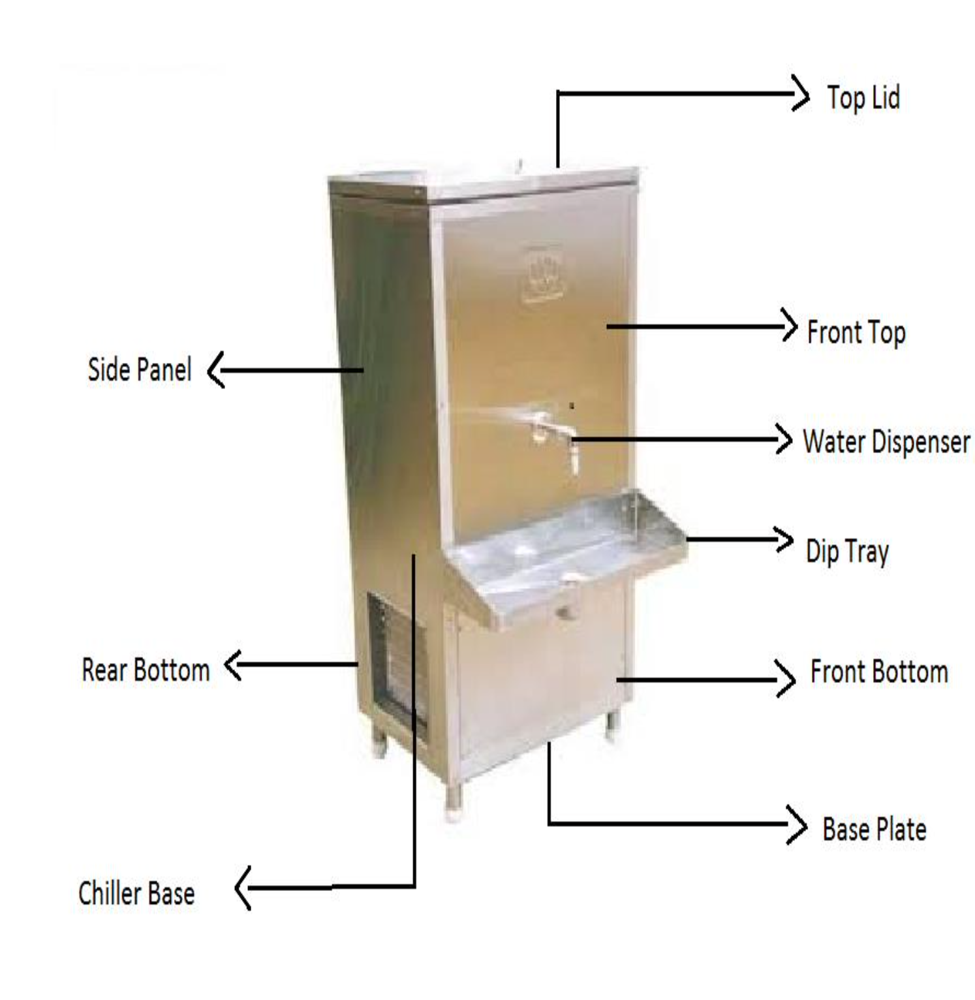

# cad-cam

## WATER COOLER
A water cooler or water dispenser is a device that cools and dispenses water
They are generally broken up in two categories: bottleless and bottled water coolers.

Bottleless water coolers are connected to a water supply, while bottled water coolers require delivery (or self-pick- up) of water in large bottles from vendors.
Water cooler may also refer to a primitive device for keeping water cool

### Structural Parts of a water cooler
- Top Lid
- Front Top 
- Rear Top
- Water Tank
- Chiller Base 
- Front Bottom 
- Rear Bottom
- Base Plate
- Dip Tray

### Interior Parts of the water cooler
- Condenser Coil - Compressor
- Motor
- Fan
- Dryer
- Inner Angle - Capillary
- Thermostat
- Float Ball - Mesh

### External parts of water cooler
